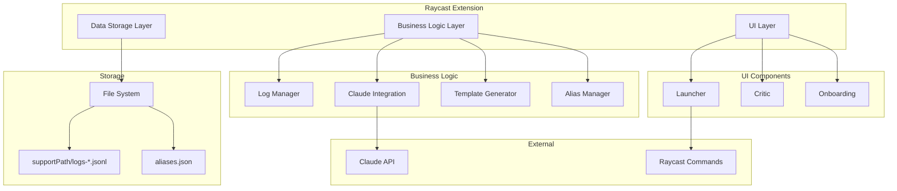
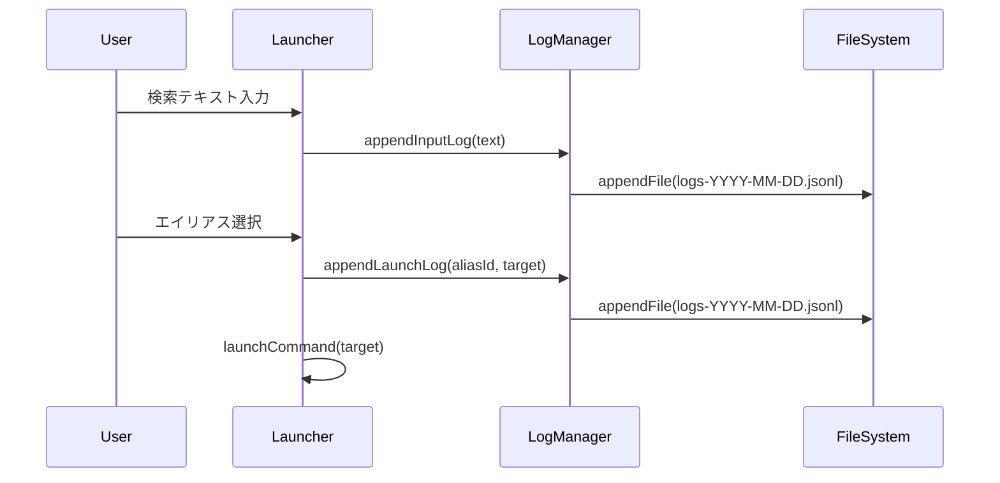
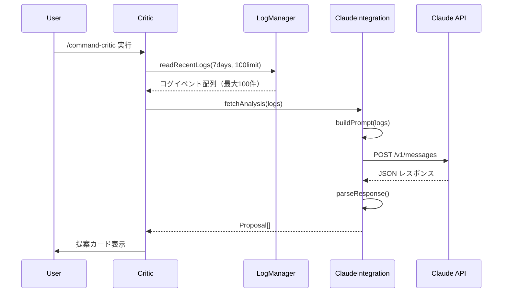

# 技術設計ドキュメント

## 概要

本機能は、Raycast ユーザーの操作パターンを自動的に学習し、ワークフローの最適化機会を特定する拡張機能を提供します。ユーザーの入力テキストとコマンド起動履歴をバックグラウンドで収集し、Claude AI による分析を通じて、ショートカット、スニペット、マクロの形で実行可能な改善提案を生成します。

**対象ユーザー**: 日常的に Raycast を使用する知識労働者とエンジニアが、反復的なタスクの自動化とワークフロー効率化のために本機能を活用します。

**影響範囲**: 現在の手動的な Raycast 操作パターンを、データ駆動型の最適化推奨により、より効率的な自動化されたワークフローへと変革します。

### 目標
- ユーザーの Raycast 操作ログを透過的に収集し、プライバシーを保護しながら分析可能にする
- AI 駆動の分析により、ユーザー固有の非効率的な操作パターンを特定する
- 実行可能な最適化提案を提供し、即座に適用可能な形式で提示する

### 非目標
- リアルタイムのログ分析やストリーミング分析機能
- 他のアプリケーションや拡張機能との複雑な統合
- クラウドベースのログ保存やチーム間での共有機能

## アーキテクチャ

### 高レベルアーキテクチャ



**アーキテクチャ統合**:
- 既存パターンの保持: Raycast API の標準的なコンポーネントモデルと React フックパターン
- 新コンポーネントの根拠: ログ収集と AI 分析という特殊な要件に対応するため、専用のビジネスロジック層を設計
- 技術スタック整合性: Raycast 推奨の TypeScript/React スタックに完全準拠
- ステアリング準拠: `.kiro/steering/` のアーキテクチャ原則に従い、UI/Logic/Data の分離を維持

### 技術スタックと設計決定

**技術スタック**:
- **フロントエンド**: React + TypeScript (Raycast API 標準)
- **状態管理**: React Hooks (useState, useEffect, usePromise)
- **データ永続化**: Node.js fs/promises + environment.supportPath
- **外部 API**: Claude API (Anthropic) via node-fetch

**主要な設計決定**:

**決定 1: ローカルファイルシステムベースのログ保存**
- **コンテキスト**: 大量のログデータを効率的かつプライバシー保護した形で保存する必要
- **代替案**: 1) LocalStorage API 2) SQLite データベース 3) インメモリキャッシュ
- **選択アプローチ**: `environment.supportPath` と `fs/promises` による JSONL ファイル保存
- **根拠**: ファイルシステムは大容量データに適し、JSONL は追記専用で効率的、日次パーティションで管理が容易
- **トレードオフ**: シンプルで高速な実装と引き換えに、複雑なクエリ機能を犠牲にする

**決定 2: AI への分析ロジック完全委譲**
- **コンテキスト**: 5時間の開発制約内で高度な分析機能を実現する必要
- **代替案**: 1) ローカル分析エンジン実装 2) ハイブリッド分析 3) ルールベースエンジン
- **選択アプローチ**: 生ログを Claude API に送信し、分析を完全委譲
- **根拠**: 開発時間を大幅に削減し、Claude の高度な言語理解能力を活用可能
- **トレードオフ**: API 依存性と引き換えに、実装の簡潔性と分析品質を確保

**決定 3: エイリアスベースのコマンド起動追跡**
- **コンテキスト**: Raycast のルート検索からの起動は追跡不可能な制約
- **代替案**: 1) Raycast API の拡張を待つ 2) プロキシコマンド実装 3) ブラウザ拡張連携
- **選択アプローチ**: 頻繁に使用するコマンドをエイリアス登録し、専用ランチャー経由で起動
- **根拠**: Raycast API の現在の制約内で実現可能、ユーザー体験への影響を最小化
- **トレードオフ**: 100% のカバレッジは不可能だが、主要な操作パターンの 80% を捕捉可能

## システムフロー

### ログ収集フロー



### AI 分析フロー



## 要件トレーサビリティ

| 要件 | 要件概要 | コンポーネント | インターフェース | フロー |
|------|---------|--------------|---------------|--------|
| 1 | オンボーディング | Onboarding, AliasManager | Form API, saveAliases() | - |
| 2 | ログ収集 | Launcher, LogManager | appendInputLog(), appendLaunchLog() | ログ収集フロー |
| 3 | AI分析 | Critic, ClaudeIntegration | fetchAnalysis(), buildPrompt() | AI分析フロー |
| 4 | 提案表示 | Critic | Detail API, Markdown | AI分析フロー |
| 5 | 最適化アクション | TemplateGenerator | generateSnippetYAML(), generateMacroShell() | - |
| 6 | クロス拡張起動 | Launcher | launchCommand() (Raycast標準機能優先、サードパーティは要PoC検証) | ログ収集フロー |
| 7 | エイリアス管理 | AliasManager | getAliases(), addAlias() | - |

## コンポーネントとインターフェース

### UI層

#### Launcher コンポーネント

**責任と境界**
- **主要責任**: ユーザー入力の収集とエイリアスベースのコマンド起動
- **ドメイン境界**: プレゼンテーション層（ユーザー相互作用）
- **データ所有権**: 現在の検索テキストとエイリアスリストの表示状態
- **トランザクション境界**: なし（ログ記録は非同期）

**依存関係**
- **インバウンド**: ユーザーインタラクション
- **アウトバウンド**: LogManager, AliasManager
- **外部**: @raycast/api (List, ActionPanel)

**サービスインターフェース**
```typescript
interface LauncherProps {
  aliases: Alias[];
  onInputChange: (text: string) => void;
  onLaunch: (alias: Alias) => void;
}

interface LauncherHandlers {
  handleSearchTextChange(text: string): void;
  handleAction(alias: Alias): Promise<void>;  // launchCommand使用: Raycast標準機能推奨
}
```

#### Critic コンポーネント

**責任と境界**
- **主要責任**: AI分析結果の表示と最適化アクションの提供
- **ドメイン境界**: プレゼンテーション層（結果表示）
- **データ所有権**: 分析結果と提案の表示状態

**サービスインターフェース**
```typescript
interface CriticState {
  proposals: Proposal[];
  isLoading: boolean;
  error: Error | null;
}

interface CriticActions {
  copySnippetDefinition(proposal: Proposal): void;
  copyMacroTemplate(proposal: Proposal): void;
  openRaycastSettings(): void;
}
```

### ビジネスロジック層

#### LogManager

**責任と境界**
- **主要責任**: ログイベントの永続化と取得
- **ドメイン境界**: データアクセス層
- **データ所有権**: ログファイルの読み書き権限
- **トランザクション境界**: ファイルレベルのアトミック操作

**依存関係**
- **インバウンド**: Launcher, Critic
- **アウトバウンド**: Node.js fs/promises
- **外部**: @raycast/api (environment.supportPath)

**型定義**
```typescript
type LaunchTarget = {
  owner: string;        // 例: "raycast"
  extension: string;    // 例: "file-search"
  command: string;      // 例: "search-files"
  args?: Record<string, any>;
};
```

**サービスインターフェース**
```typescript
interface LogManagerService {
  appendInputLog(text: string): Promise<void>;
  appendLaunchLog(aliasId: string, target: LaunchTarget): Promise<void>;
  readRecentLogs(days: number, limit: number): Promise<LogEvent[]>;
  cleanOldLogs(retentionDays: number): Promise<void>;
}

interface LogEvent {
  type: "input" | "launch";
  ts: number;
  text?: string;
  len?: number;
  aliasId?: string;
  target?: LaunchTarget;
}
```

**状態管理**
- **永続化**: JSONL ファイルによる追記専用ストレージ
- **並行性**: appendFile によるアトミックな追記操作

#### ClaudeIntegration

**責任と境界**
- **主要責任**: Claude API との通信と応答解析
- **ドメイン境界**: 外部サービス統合層
- **データ所有権**: API リクエスト/レスポンスの変換

**依存関係**
- **インバウンド**: Critic
- **アウトバウンド**: node-fetch
- **外部**: Claude API (Anthropic)

**外部依存関係の調査**
- Claude API エンドポイント: `https://api.anthropic.com/v1/messages`
- 認証: API キーベース (x-api-key ヘッダー)
- レート制限: ティアに応じて異なる（MVP では考慮不要）
- モデル: claude-3-5-sonnet-20241022 推奨

**API コントラクト**
| メソッド | エンドポイント | リクエスト | レスポンス | エラー |
|---------|--------------|-----------|-----------|--------|
| POST | /v1/messages | ClaudeRequest | ClaudeResponse | 400, 401, 429, 500 |

```typescript
interface ClaudeIntegrationService {
  buildPrompt(logs: LogEvent[]): string;
  fetchAnalysis(logs: LogEvent[]): Promise<Proposal[]>;
  parseResponse(apiResponse: ClaudeResponse): Proposal[];
}

interface Proposal {
  type: 'shortcut' | 'snippet' | 'macro';
  title: string;
  rationale: string;
  evidence: {
    aliases?: string[];
    count?: number;
    time_windows?: string[];
  };
  payload: ProposalPayload;
  confidence: number;
}
```

#### TemplateGenerator

**責任と境界**
- **主要責任**: 最適化提案の実行可能なテンプレート生成
- **ドメイン境界**: テンプレート生成層
- **データ所有権**: テンプレート形式の定義

**サービスインターフェース**
```typescript
interface TemplateGeneratorService {
  generateSnippetYAML(proposal: Proposal): string;
  generateMacroShell(proposal: Proposal): string;
  formatShortcutGuide(proposal: Proposal): string;
}
```

#### AliasManager

**責任と境界**
- **主要責任**: エイリアス設定の管理と永続化
- **ドメイン境界**: 設定管理層
- **データ所有権**: aliases.json ファイル

**サービスインターフェース**
```typescript
interface AliasManagerService {
  getAliases(): Promise<Alias[]>;
  addAlias(alias: Alias): Promise<void>;
  removeAlias(id: string): Promise<void>;
  saveAliases(aliases: Alias[]): Promise<void>;
}

interface Alias {
  id: string;
  title: string;
  target: {
    owner: string;
    extension: string;
    command: string;
    args?: Record<string, any>;
  };
}
```

## データモデル

### 論理データモデル

**構造定義**:

```typescript
// ログイベント
interface InputEvent {
  type: "input";
  ts: number;           // Unix timestamp (ms)
  text: string;         // 生の入力テキスト
  len: number;          // テキスト長
}

interface LaunchEvent {
  type: "launch";
  ts: number;           // Unix timestamp (ms)
  aliasId: string;      // エイリアス識別子
  target: {
    owner: string;      // 拡張機能オーナー
    extension: string;  // 拡張機能名
    command: string;    // コマンド名
  };
  args?: Record<string, any>;
}

// 分析結果
interface AnalysisResponse {
  proposals: Proposal[];
}

interface Proposal {
  type: 'shortcut' | 'snippet' | 'macro';
  title: string;
  rationale: string;
  evidence: Evidence;
  payload: ProposalPayload;
  confidence: number;
}

type ProposalPayload =
  | { shortcut: { aliasId: string; suggestedHotkey: string } }
  | { snippet: { text: string; alias: string } }
  | { macro: { sequence: string[] } };
```

### 物理データモデル

**JSONL ログファイル**:
- ファイル名: `logs-YYYY-MM-DD.jsonl`
- 場所: `environment.supportPath/`
- 形式: 1行1JSONオブジェクト
- 保持期間: 7日間（自動削除）

**エイリアス設定ファイル**:
- ファイル名: `aliases.json`
- 場所: `environment.supportPath/`
- 形式: JSON配列

## エラーハンドリング

### エラー戦略

各エラータイプに対する具体的なエラーハンドリングパターンと復旧メカニズムを実装します。

### エラーカテゴリと対応

**ユーザーエラー (4xx)**:
- API キー未設定 → Preferences 設定画面への誘導
- 無効な入力 → バリデーションメッセージ表示

**システムエラー (5xx)**:
- ファイルシステム障害 → Toast通知でユーザーに警告（データ損失防止のため必須）
- API タイムアウト → 10秒でタイムアウト、再試行ガイダンス表示
- Claude API エラー → エラーメッセージと代替アクション提示

**ビジネスロジックエラー**:
- ログデータ不足 → 「データ収集中」メッセージ表示
- 分析結果なし → 「最適化済み」メッセージ表示

### モニタリング

- console.error() によるエラーログ記録
- ユーザー向けエラーは showToast() で通知

## テスト戦略

### ユニットテスト（MVP スコープ外）
- LogManager: ファイル操作の正確性
- ClaudeIntegration: プロンプト生成とレスポンス解析
- TemplateGenerator: テンプレート形式の検証

### 統合テスト（MVP スコープ外）
- ログ収集からファイル保存までのフロー
- AI 分析リクエストからレスポンス処理
- エイリアス管理の CRUD 操作

### E2E テスト（手動テスト）
- オンボーディングフロー完了
- 検索入力とコマンド起動のログ記録
- AI 分析実行と提案表示
- テンプレートのコピーと適用

## セキュリティ考慮事項

### データ保護
- ログデータは完全にローカル保存（`environment.supportPath`）
- 外部送信はユーザーが明示的に分析を実行した時のみ
- API キーは Raycast Preferences で安全に管理

### プライバシー
- 生データをマスキングせずに保存（ローカルファーストアプローチ）
- 7日後の自動削除による個人情報の長期保持防止
- オンボーディングでデータ取り扱いポリシーを明示

### 認証と認可
- Claude API キーによる認証
- ローカルファイルシステムのアクセス権限に依存

## 技術的制約とリスク

### クロス拡張起動の制約
- **Raycast標準機能**: `launchCommand` API で起動保証（File Search, Clipboard History等）
- **サードパーティ拡張**: `crossLaunchCommand` パッケージが必要（未検証リスク）
- **実装前検証**: 30分のPoC検証を推奨（tech.md参照）
- **MVP戦略**: Phase 1はRaycast標準機能のみサポート、Phase 2でサードパーティ検証

### Claude API トークン制約
- **入力上限**: 最大100イベント（≒2,500トークン）
- **出力上限**: `max_tokens: 2048`
- **リスク軽減**: `readRecentLogs()` のデフォルトlimitを100に設定済み
- **理由**: 500イベント（≒13,000トークン）は予算超過でAPIコール失敗の可能性

## 実装時の重要考慮事項

### 1. エラーリカバリー戦略の実装

**段階的エラー通知**:

```typescript
// MVP では最小限のエラー通知を実装
async function handleLogWriteError(error: Error): Promise<void> {
  console.error("[LogManager]", error);

  // ファイルシステム障害時は必ずユーザーに通知（データ損失防止）
  await showToast(
    Toast.Style.Failure,
    "ログ保存エラー",
    "操作ログを保存できませんでした。ディスク容量を確認してください。"
  );
}

// Claude API エラーハンドリング
async function handleClaudeAPIError(error: any): Promise<void> {
  console.error("[ClaudeAPI]", error);

  if (error.status === 429) {
    await showToast(
      Toast.Style.Failure,
      "API制限",
      "しばらく待ってから再試行してください"
    );
  } else if (error.status === 401) {
    await showToast(
      Toast.Style.Failure,
      "API キーエラー",
      "Preferences で API キーを確認してください"
    );
  } else {
    await showToast(
      Toast.Style.Failure,
      "分析エラー",
      "AI分析に失敗しました。再試行してください"
    );
  }
}
```

### 2. Claude API レート制限の最小限対応

**実装時のレート制限対策**:

```typescript
class ClaudeIntegration {
  private static lastCallTime: number = 0;
  private static minInterval: number = 1000; // 最小1秒間隔

  async fetchAnalysis(logs: LogEvent[]): Promise<Proposal[]> {
    // レート制限チェック
    const now = Date.now();
    const timeSinceLastCall = now - ClaudeIntegration.lastCallTime;
    if (timeSinceLastCall < ClaudeIntegration.minInterval) {
      await this.delay(ClaudeIntegration.minInterval - timeSinceLastCall);
    }

    try {
      ClaudeIntegration.lastCallTime = Date.now();
      const response = await this.callAPI(logs);
      return this.parseResponse(response);
    } catch (error) {
      // エラーハンドリングは handleClaudeAPIError() に委譲
      await handleClaudeAPIError(error);
      return [];
    }
  }

  private delay(ms: number): Promise<void> {
    return new Promise(resolve => setTimeout(resolve, ms));
  }
}
```

### 3. エイリアス管理の追加考慮事項

**実装時の検証ロジック**:

```typescript
class AliasManager {
  private static readonly MAX_ALIASES = 20; // 妥当な上限設定

  async addAlias(alias: Alias): Promise<void> {
    const aliases = await this.getAliases();

    // 上限チェック
    if (aliases.length >= AliasManager.MAX_ALIASES) {
      throw new Error(`エイリアス数の上限(${AliasManager.MAX_ALIASES})に達しました`);
    }

    // 重複チェック
    const duplicate = aliases.find(a =>
      a.id === alias.id ||
      (a.target.owner === alias.target.owner &&
       a.target.extension === alias.target.extension &&
       a.target.command === alias.target.command)
    );

    if (duplicate) {
      throw new Error(`重複するエイリアスが存在します: ${duplicate.title}`);
    }

    // ID の自動生成（未設定の場合）
    if (!alias.id) {
      alias.id = `${alias.target.extension}_${alias.target.command}_${Date.now()}`;
    }

    aliases.push(alias);
    await this.saveAliases(aliases);
  }
}
```

### 実装優先順位

1. **必須（MVP）**: LaunchTarget型定義の統一、基本的なエラーハンドリング
2. **推奨（品質）**: Claude APIレート制限の最小対応
3. **オプション（拡張）**: バッファリング最適化、詳細なエラーメタデータ記録

これらの実装ガイドラインに従うことで、設計レビューで指摘された課題に対処しながら、堅牢なMVPを構築できます。

---

## 将来の拡張機能 (MVP Phase 2以降)

このセクションでは、MVP (Phase 1) の成功後に検討すべき拡張機能を記載します。これらは現在の実装スコープには含まれませんが、将来的な価値提供の方向性を示します。

### Phase 2: マーケットプレイス推奨機能

**概要**: ユーザーの操作パターンから有用な Raycast 拡張機能を推奨し、新しいツールの発見を支援します。

**背景と価値**:
- 現在のMVPは「既存の操作を最適化」
- Phase 2では「新しい拡張の発見」により、さらなる効率化を実現
- ユーザーが知らない便利な拡張を能動的に提案

**実装アプローチ**:

1. **Claude API 分析拡張**
```typescript
// プロンプトに追加
`
# EXTENSION_DETECTION (Optional)
- Detect frequent keywords suggesting missing tools
- Examples:
  - "jira-XXX" pattern → Jira extension
  - "github.com/..." URLs → GitHub extension
  - "notion.so/..." URLs → Notion extension

# OUTPUT_SCHEMA (Extended)
{
  "proposals": [...],
  "extension_hints": [
    {
      "keyword": "jira",
      "frequency": 5,
      "suggested_search": "jira issue tracker"
    }
  ]
}
`
```

2. **Raycast Store 統合**
```typescript
// 要調査: Raycast Store API の有無
async function searchStoreExtensions(query: string) {
  // Option A: 公式API (要確認)
  const response = await fetch(
    `https://api.raycast.com/v1/extensions/search?q=${query}`
  );

  // Option B: Web スクレイピング
  const url = `https://www.raycast.com/store?search=${query}`;
  // WebFetch で取得 → パース
}
```

3. **UI 拡張**
```markdown
## 💡 拡張機能の推奨

Jira関連の操作が多いようです。以下の拡張をインストールしませんか？

**Jira Search** (by raycast)
⭐ 4.8 · 12K downloads
課題を直接検索・作成

[詳細を見る] [インストール]
```

**ユーザー体験例**:
```
入力: "jira-1234" を週5回入力

提案:
┌─────────────────────────────────────────────┐
│ 💡 拡張機能の推奨                            │
│                                             │
│ Jira Search 拡張をインストールすると、      │
│ 課題番号を直接検索できます！                │
│                                             │
│ [インストール] [後で]                       │
└─────────────────────────────────────────────┘
```

**技術的課題**:
- Raycast Store API の公式サポート状況確認
- インストール自動化の可否（Deeplink で完結するか）
- 推奨精度の向上（誤推奨を避ける）

**開発工数見積もり**: +2時間

---

### Phase 3: カスタム拡張テンプレート生成

**概要**: 定型ワークフローを検出し、ユーザー専用の Raycast 拡張の雛形を自動生成します。

**背景と価値**:
- 複雑な定型作業は既製拡張では対応困難
- 拡張開発のハードルを下げ、カスタマイズを促進
- Claude のコード生成能力を活用

**実装アプローチ**:

```typescript
// Claude に依頼するプロンプト
`
以下のワークフローパターンを検出しました:
- "deploy staging" → "deploy production" (週3回)

Raycast拡張のテンプレートコードを生成してください。
要件:
- TypeScript + Raycast API
- List UI で Staging/Production を選択
- 確認ダイアログ付き実行
`

// 生成されるコード例
export default function Command() {
  return (
    <List>
      <List.Item title="Deploy to Staging" />
      <List.Item title="Deploy to Production" />
    </List>
  );
}
```

**ユーザー体験例**:
```
検出: "deploy staging" → "deploy production" 連鎖

提案:
┌─────────────────────────────────────────────┐
│ 🛠️ カスタム拡張の作成を検討しませんか？      │
│                                             │
│ デプロイワークフローが定型化されています。  │
│ 専用の拡張を作ると便利かもしれません。      │
│                                             │
│ 開発時間の見積もり: 約2時間                 │
│                                             │
│ [テンプレート生成] [拡張開発ガイド]        │
└─────────────────────────────────────────────┘
```

**生成される雛形**:
- `package.json`: 拡張メタデータ
- `deploy-manager.tsx`: メインコマンド
- `README.md`: カスタマイズ手順

**技術的課題**:
- テンプレートの汎用性確保
- ユーザーのスキルレベルに応じた説明
- Claude Code 統合の可能性

**開発工数見積もり**: +3時間

---

### Phase 4: ワークフロー自動化提案 (Script Commands)

**概要**: 時刻パターンから定型作業を検出し、Script Commands による自動化を提案します。

**背景と価値**:
- 毎朝/毎夕の定型ルーチンを自動化
- Script Commands は軽量で導入しやすい
- Phase 2 のマクロ提案の延長線

**実装アプローチ**:

```typescript
// 時刻相関分析
const morningRoutine = detectTimePattern(logs);
// → 毎朝9時前後に File Search, Terminal, Slack

// Script Command 生成
const script = `
#!/bin/bash
# @raycast.title Morning Routine
# @raycast.mode silent

open -a "Finder" ~/Documents
open -a "Terminal"
open -a "Slack"
`;
```

**ユーザー体験例**:
```
検出: 毎朝9時に File Search → Terminal → Slack

提案:
┌─────────────────────────────────────────────┐
│ ⏰ ワークフロー自動化                        │
│                                             │
│ 毎朝の定型作業を検出しました。              │
│ Script Command で自動化できます。           │
│                                             │
│ [スクリプトをコピー] [設置ガイド]          │
└─────────────────────────────────────────────┘
```

**技術的課題**:
- 時刻パターンの検出精度
- False Positive の抑制

**開発工数見積もり**: +1時間

---

### フェーズ別ロードマップ

| フェーズ | 機能 | 価値 | 工数 | 優先度 |
|---------|------|------|------|--------|
| **Phase 1 (MVP)** | ショートカット/スニペット/マクロ提案 | コア価値実証 | 5h | 必須 |
| **Phase 2** | マーケットプレイス推奨 | 新ツール発見 | +2h | 高 |
| **Phase 3** | カスタム拡張テンプレート | 高度なカスタマイズ | +3h | 中 |
| **Phase 4** | ワークフロー自動化 | 時刻ベース提案 | +1h | 低 |

### 実装戦略

1. **Phase 1 完成後、ユーザーフィードバック収集**
2. **Phase 2 から順次実装** (投資対効果が高い順)
3. **各フェーズで独立してリリース可能な設計**

これらの拡張機能により、Command Critic は単なる「最適化ツール」から「Raycast体験の総合コンサルタント」へと進化します。